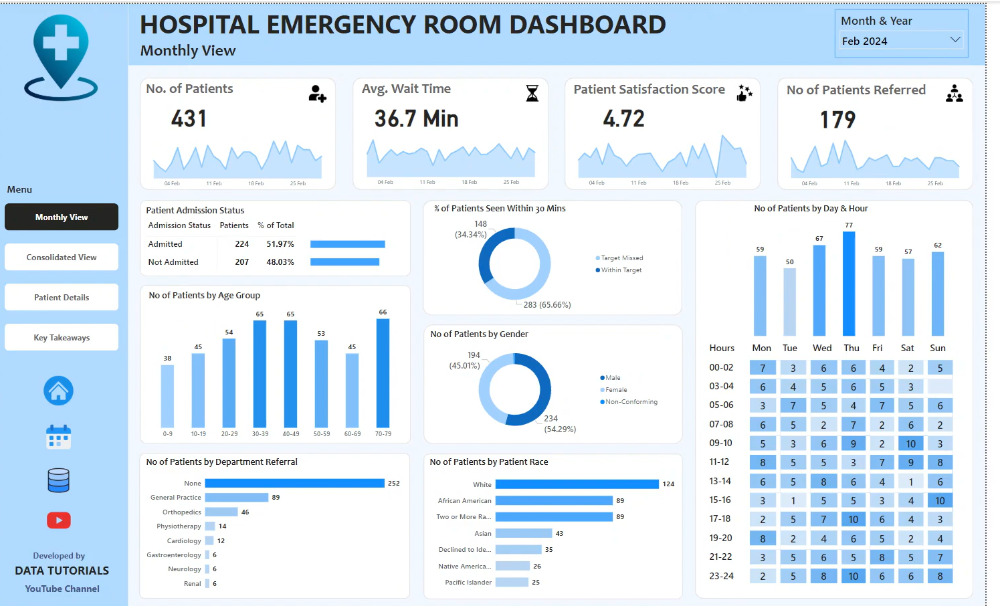

# hospital-emergency-room-dashboard

Interactive Power BI dashboard analyzing hospital emergency room performance, patient demographics, wait times, satisfaction scores, admissions, and department referrals.
# 🏥 Hospital Emergency Room Dashboard | Power BI

## 📌 Project Overview

The **Hospital Emergency Room Dashboard** is an interactive Power BI project designed to analyze and monitor Emergency Room (ER) performance.

The dashboard provides insights into patient volume, admission status, waiting time, patient satisfaction, department referrals, and patient demographics.

The objective of this project is to help hospital stakeholders understand operational trends, identify potential bottlenecks, and make data-driven decisions to improve emergency room efficiency and patient experience.

---

## 🎯 Business Objective

The primary objective of this project is to analyze Emergency Room operations and provide actionable insights related to:

- Patient volume and admission trends
- Average patient waiting time
- Patient satisfaction
- Department referrals
- Patient demographics
- Admission status
- Peak days and hours
- Timeliness of patient service

---

## 🛠️ Tools & Technologies

- **Power BI**
- **Power Query**
- **DAX**
- **Microsoft Excel / CSV**
- **Data Cleaning & Transformation**
- **Data Modeling**
- **Data Visualization**
- **KPI Analysis**

---

## 🔄 Project Workflow

The project was developed using the following workflow:

1. Requirement Gathering
2. Business Requirements Analysis
3. Data Walkthrough
4. Data Connection
5. Data Cleaning
6. Data Quality Check
7. Data Modeling
8. Data Processing
9. DAX Calculations
10. Dashboard Layout Design
11. Charts Development & Formatting
12. Dashboard Development
13. Insights Generation

---

# 📊 Dashboard Overview

The Power BI report contains **4 interactive dashboard pages**.

---

## 1️⃣ Monthly View

The Monthly View provides a month-wise analysis of Emergency Room performance.

### Key Analysis:

- Total Number of Patients
- Patient Admission Status
- Average Wait Time
- Patient Satisfaction Score
- Patient Age Distribution
- Gender Distribution
- Race Distribution
- Department Referrals
- Percentage of Patients Seen Within 30 Minutes
- Patient Volume by Day
- Patient Volume by Hour

### Objective

To identify monthly patterns, peak periods, admission trends, waiting-time patterns, and demographic distribution.

### Dashboard Preview


---

## 2️⃣ Consolidated View

The Consolidated View provides a high-level overview of Emergency Room performance for a selected date range.

### Key Metrics:

- Total Patients
- Average Wait Time
- Average Satisfaction Score
- Number of Referrals
- Admission Status
- Timeliness
- Patient Demographics
- Department Referral Trends

### Objective

To provide stakeholders with a holistic view of Emergency Room operations and performance over a customizable period.

### Dashboard Preview


---

## 3️⃣ Patient Details

The Patient Details page provides granular patient-level information for detailed analysis.

### Information Included:

| Field | Description |
|---|---|
| Patient ID | Unique identifier assigned to each patient |
| Patient Name | Patient name available in the dataset |
| Gender | Patient gender |
| Age | Patient age |
| Admission Date | Date of ER admission |
| Race | Patient race/ethnicity category |
| Wait Time | Time waited before being attended |
| Department Referral | Department referred to |
| Admission Status | Whether the patient was admitted |

### Objective

To enable detailed patient-level analysis and support operational troubleshooting.

### Dashboard Preview


---

## 4️⃣ Key Takeaways

The Key Takeaways page summarizes the major findings obtained from the dashboard.

### Focus Areas:

- Patient volume trends
- Waiting-time patterns
- Patient satisfaction
- Admission trends
- Department referral patterns
- Demographic trends
- Peak days and hours
- Areas for operational improvement

### Objective

To convert dashboard analysis into clear and actionable insights for hospital stakeholders.

### Dashboard Preview


---

# 📈 Key Performance Indicators (KPIs)

The dashboard tracks the following important KPIs:

### 👥 Number of Patients
Measures the total number of patients visiting the Emergency Room.

### ⏱️ Average Wait Time
Measures the average time patients wait before being attended by medical staff.

### ⭐ Patient Satisfaction Score
Measures the overall patient satisfaction with the Emergency Room experience.

### 🏥 Number of Patients Referred
Tracks the number of patients referred to different hospital departments.

### 📋 Admission Status
Analyzes admitted versus non-admitted patients.

### ⚡ Timeliness
Measures the percentage of patients who were attended within 30 minutes.

---

# 📊 Data Analysis Performed

The project includes analysis across multiple dimensions:

### Patient Demographics
- Age
- Gender
- Race

### Operational Analysis
- Patient volume
- Wait time
- Admission status
- Department referrals
- Timeliness

### Time-Based Analysis
- Month
- Day
- Hour
- Daily patient trends

### Patient Experience
- Satisfaction score
- Waiting time
- Timeliness

---

# 🧹 Data Cleaning & Transformation

Data preparation was performed using **Power Query**.

Key data preparation activities included:

- Removing unnecessary columns
- Handling missing values
- Checking data types
- Standardizing categorical values
- Creating required calculated columns
- Validating data quality
- Preparing data for analysis
- Creating appropriate date/time fields

---

# 🧮 DAX Calculations

DAX was used to create analytical measures and KPIs required for the dashboard.

Examples of calculated metrics include:

- Total Patients
- Average Wait Time
- Average Satisfaction Score
- Patient Referral Count
- Admission Count
- Admission Percentage
- Timeliness Percentage

---

# 💡 Key Insights

The dashboard helps identify:

- Periods with higher Emergency Room patient volume
- Peak days and hours requiring additional operational attention
- Departments receiving higher patient referrals
- Trends in patient waiting time
- Differences in admission patterns
- Patient satisfaction trends
- Demographic distribution of ER patients
- Potential areas for improving operational efficiency

> **Note:** Specific numerical findings should be updated based on the final dashboard results.

---

# 📂 Project Structure

```text
Hospital-Emergency-Room-Dashboard/
│
├── Hospital_Emergency_Room_Dashboard.pbix
│
├── Dataset/
│   └── Hospital_Emergency_Room_Data.csv
│
├── Screenshots/
│   ├── monthly-view.png
│   ├── consolidated-view.png
│   ├── patient-details.png
│   └── key-takeaways.png
│
├── Documentation/
│
└── README.md
